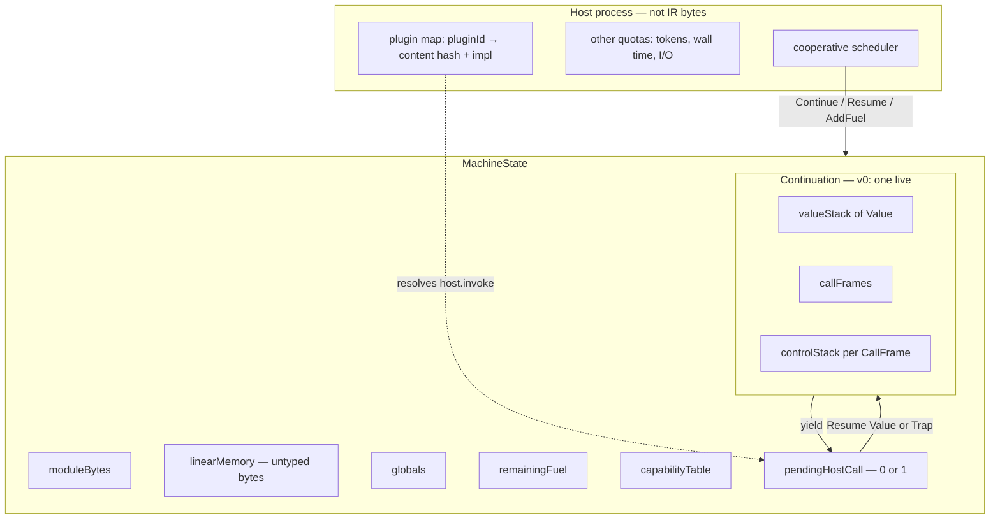
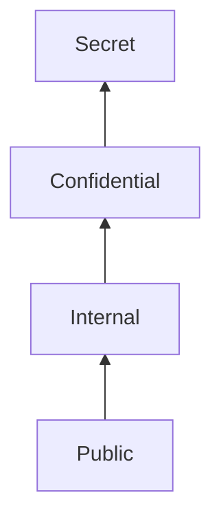

# RFC 0002 — Tollana Intermediate Representation Version 0

| Field | Value |
|-------|--------|
| **RFC** | 0002 |
| **Title** | Tollana Intermediate Representation Version 0 |
| **Category** | Standards Track |
| **Status** | Proposed Standard |
| **Created** | 2026-08-19 |
| **Spec version** | Tollana IR v0 |
| **formatVersion** | 1 |
| **Updates** | — |
| **Obsoletes** | — |
| **Relates** | [RFC 0001 — Architecture](architecture.md) |

## Abstract

This document specifies Tollana IR version 0: the instruction set, value types, validation, text and binary module encodings, the `host.invoke` suspend/resume protocol, the IR-level snapshot surface, and conformance programs.

Tollana IR is the native format of the Tollana stack-machine interpreter defined by [RFC 0001](architecture.md). It is not WebAssembly and does not depend on a WebAssembly runtime. A breaking change to this ISA MUST increment `formatVersion` or be published as a new RFC.

Implementation sequencing and pull-request order are not requirements of this document.

## Status of This Memo

This is a standards-track specification. Implementations MUST follow the requirements herein. Sections marked non-normative are informational.

---

## Table of Contents

1. [Introduction](#overview)
2. [Background](#background-and-motivation)
3. [Conventions](#rfc-2119-language)
4. [Canonical Naming](#canonical-naming)
5. [Scope](#goals-and-non-goals)
6. [Abstract Machine](#abstract-machine)
7. [Value Types and Sensitivity Labels](#value-types-and-sensitivity-labels)
8. [Traps versus Suspend](#traps-versus-suspend)
9. [Validation](#validation)
10. [Instruction Reference](#instruction-reference)
11. [host.invoke Protocol](#invokehostplugin-protocol)
12. [Module Format](#module-format)
13. [IR-Level Snapshot Surface](#ir-level-snapshot-surface)
14. [Instantiation and Invocation Interface](#instantiation-and-invocation-interface)
15. [Conformance Programs](#conformance-programs)
16. [Appendix A — Alternatives Considered](#alternatives-considered)
17. [Appendix B — Reserved Extensions](#reserved-extensions-non-normative)
18. [Security and Privacy Considerations](#security-and-privacy-considerations)
19. [Observability](#observability)
20. [IANA Considerations](#iana-considerations)
21. [References](#references)

---

## Overview

[RFC 0001](architecture.md) requires that a guest program can **call a host function, be snapshotted mid-await, restored on a fresh machine, and continue correctly**. This RFC defines the IR that makes that contract executable. The core is an explicit stack-machine interpreter. Its native format is Tollana IR — not WebAssembly, not a WASM engine.

This specification defines:

- Tagged runtime values (`i32`, `i64`, `unit`, `Capability`) with a two-bit `Label`.
- A closed v0 instruction set using WASM-text names (`i32.add`, `local.get`, `host.invoke`). The ISA is still Tollana IR, not WebAssembly.
- Text (`.tir`) and binary (`.tirb`) module encodings whose source of truth is the decoded `Instruction` stream.
- `host.invoke` as the **only** host-call opcode: it suspends the `Continuation` and yields `HostCall`; the host runs asynchronously; resume pushes a `Value` or traps.
- Fuel checked **before** each instruction; exhaustion is resumable `OutOfFuel`, not a trap.
- An IR-level snapshot record that MUST round-trip core machine state (the on-disk AEAD container remains architecture-owned).

Implementers MUST be able to write `MachineState`, the interpreter loop, and the seven conformance programs **without inventing opcode meanings**.

---

## Background and Motivation

[RFC 0001](architecture.md) locks an interpreter-first core so the runtime owns stacks, frames, continuations, linear memory, capabilities, and fuel. External WASM runtimes are not part of the abstract machine. Guest languages will later lower to this IR or embed a snapshot-friendly runtime inside `MachineState`.

Pain points this v0 slice addresses:

- There is no executable contract for “suspend on host call / snapshot / restore / resume.”
- Plugin dispatch is numeric (`pluginId` + `methodId`) but had no instruction or module import shape.
- Capability unforgeability and sensitivity labels MUST live in the value representation from v0, even if full attenuation lands later.
- Tests need a hand-writable text format and a compact binary with fixed-width immediates.

Version 0 is complete for the durability contract: integer arithmetic, bounds-checked memory, structured control, one live continuation, and one in-flight host call. It is not a language platform.

---

## RFC 2119 Language

The key words **MUST**, **MUST NOT**, **REQUIRED**, **SHALL**, **SHALL NOT**, **SHOULD**, **SHOULD NOT**, **RECOMMENDED**, **MAY**, and **OPTIONAL** in this document are to be interpreted as described in [RFC 2119](https://datatracker.ietf.org/doc/html/rfc2119).

**Normative** sections: abstract machine, values, validation, every instruction, host-call protocol, encodings, snapshot field set, instantiation/invocation API, conformance programs, and the **Limits** tables (hard vs instance-config).

**Non-normative** sections: introduction, background, alternatives, reserved extensions, examples marked “illustrative.”

---

## Canonical Naming

**Opcodes** follow WASM text: `type.op` with a dot (`i32.add`, `i64.div_s`, `local.get`, `memory.size`, `host.invoke`). Control names match WASM text (`block`, `loop`, `if`, `else`, `end`, `br`, `br_if`, `call`, `return`, `drop`, `nop`, `unreachable`).

This is a **naming** convention. The binary is Tollana IR (`TIR\0`), not WASM. There is no WASM opcode map.

**Types** use the same spellings as Rust / WASM: `i32`, `i64`, `u8`, `u16`, `u32`, `u64`, plus Tollana’s `unit` and `Capability`.

**Machine objects** stay full words (not UNIX one-letter types): `Value`, `ValueType`, `Instruction`, `MachineState`, `Continuation`, `CallFrame`, `HostCall`, `CapHandle`, `Label`. MUST NOT: `Instr`, `Val`, `ValType`, `pc` as a type or field.

| Kind | Canonical | MUST NOT use |
|------|-----------|--------------|
| Integers | `i32`, `i64` | `Integer32`, `int32` |
| Unsigned widths | `u8`, `u16`, `u32`, `u64` | `UnsignedInteger32` |
| Other values | `unit`, `Capability` | `void`, `()`, `cap` as a type |
| Ops | `i32.add`, `i32.const`, `i32.div_s`, `local.get`, `local.tee`, `host.invoke` | `addI32`, `host_invoke`, `hostInvoke` |
| Plugin ids | `pluginId`, `methodId` (values are `u32`) | `pid`, `mid` |

**Field labels:** `pluginId`, `methodId`, `functionIndex`, `instructionIndex`, `tableIndex`, `generation`, `immediateOffset`, `localIndex`, `globalIndex`, `hostImportIndex`, `labelDepth`, `typeIndex`.

**Rust mapping:** strip dots and use PascalCase (`I32Add` for `i32.add`, `I32DivS` for `i32.div_s`, `LocalGet` for `local.get`, `HostInvoke` for `host.invoke`, `BrIf` for `br_if`). Fields MAY be snake_case (`plugin_id`, `function_index`). Types `Instruction`, `MachineState`, `HostCall` keep those names.

---

## Goals and Non-Goals

### Goals

- Specify a closed v0 ISA sufficient for RFC 0001’s durability success criterion.
- Define `MachineState`, `Continuation`, `Value`, fuel, trap vs suspend so an interpreter can be written from this document alone.
- Define text and binary module encodings and a stack-typing validator specified in this document’s names.
- Define `host.invoke` suspend/resume and the IR-level snapshot round-trip.
- Provide seven conformance programs with expected traces.
- Keep opcode names in WASM text (`i32.add`, `host.invoke`).

### Non-Goals (this document and v0 ISA)

- Implementing the interpreter, crates, or tests (this RFC specifies behavior only).
- Plugin content-hash assignment ([RFC 0001](architecture.md) §6).
- On-disk AEAD snapshot/journal container ([RFC 0001](architecture.md) §11, §13).
- Goal trees, `code.run` child machines, AI gateway, language frontends, JIT.
- `Float32` / `Float64`, SIMD, GC heap objects, `String` as a `ValueType`.
- `MemoryGrow`, multiple memories, indirect call, tables, sibling continuations.
- Binary compatibility with WebAssembly.
- A full information-flow type system (labels are carried; policy is host-side).

---

## Abstract Machine

The interpreter executes one `Module` instance. v0 has **at most one live `Continuation`**. The type is still a named state object so later sibling continuations are extra instances, not a format break.

### State objects

```text
MachineState
├── moduleBytes                          raw .tirb (identity of the code)
├── entryExportName                      UTF-8; default entry is "main"
├── linearMemory                         untyped bytes; length = pageCount × 65536
├── globals[]                            Value
├── remainingFuel                        u64
├── capabilityTable[]                    CapabilityTableEntry
├── pendingHostCall                      optional HostCall
├── activeContinuationIdentifier         optional u32
└── continuations[]                      v0: length 0 or 1

Continuation
├── continuationIdentifier               u32 (v0: 0)
├── valueStack[]                         Value (top = last)
└── callFrames[]                         CallFrame (top = current)

CallFrame
├── functionIndex                        u32
├── instructionIndex                     u32  // next Instruction to execute
├── locals[]                             Value  // parameters then declared locals
├── controlStack[]                       ControlLabel
└── returnProgramCounter                 optional ProgramCounter  // None = entry frame

ProgramCounter
├── functionIndex                        u32
├── instructionIndex                     u32

ControlLabel
├── labelKind                            block | loop | if
├── parameterCount                       u32
├── resultCount                          u32
├── stackHeight                          u32  // value-stack height beneath block params
└── branchInstructionIndex               u32

CapabilityTableEntry
├── tableIndex                           u32
├── generation                           u32
├── live                                 Boolean
└── hostIdentityOpaque                   host-owned bytes; IR MUST NOT interpret

HostCall
├── pluginId                     pluginId (u32)
├── methodId                     methodId (u32)
├── arguments[]                          Value, left-to-right declaration order
├── capabilities[]                       CapHandle subsequence of arguments
└── continuationIdentifier               u32

SuspendReason
├── host.invoke
└── OutOfFuel
```

`ProgramCounter` of the current frame is the pair `(functionIndex, instructionIndex)` stored **in** that `CallFrame`. Prose MAY say “program counter.”

### Machine-state diagram



### Interpreter loop (normative)

`Continue` (see [Instantiation and Invocation Interface](#instantiation-and-invocation-interface)) first applies the **entry checks** below, then repeatedly performs a **step** until `Completed`, `Suspended`, or `Trapped`.

**`Continue` entry checks** (MUST run before any step; none of these is a guest `TrapKind`):

1. If `pendingHostCall` is present, `Continue` MUST return host API error `HostCallPending` immediately. MUST NOT enter the step loop. The host MUST use `Resume` or `TrapPending` to clear the pending call.
2. If there is no active continuation:
   - If the instance has a last guest outcome of `Completed` or `Trapped`, `Continue` MUST return that same outcome again (idempotent replay) and MUST NOT execute.
   - Else (never successfully `Invoke`d): MUST return host API error `InstanceIdle`.

On each **step**, the implementation MUST:

1. Let `frame` be the top `CallFrame`. If `instructionIndex` is out of range of that function’s decoded stream, MUST trap `InvalidProgramCounter` (malformed execution; validated modules never reach this if `br` / `return` follow this spec).
2. **Fuel check (before the instruction):** if `remainingFuel == 0`, MUST suspend with `SuspendReason.OutOfFuel` **without** executing and **without** advancing `instructionIndex`. MUST NOT set `pendingHostCall`. After `AddFuel`, the host MUST call `Continue` (not `Resume`). That `Continue` MUST re-attempt the **same** instruction, including a new fuel check.
3. Subtract `1` from `remainingFuel` (decrement only when `remainingFuel >= 1`).
4. Execute `instruction` per [Instruction Reference](#instruction-reference).

**Fuel cost:** every executed `Instruction`, including `nop`, `end`, `else`, and `host.invoke`, costs **1**. `Resume`, `TrapPending`, `AddFuel`, `SnapshotCore`, and `RestoreCore` MUST NOT decrement `remainingFuel`. Host-side plugin work is **not** IR fuel ([RFC 0001](architecture.md) §12).

**Traps and `instructionIndex`:** a trap MUST leave `instructionIndex` at the instruction that was executing (the one that just consumed fuel, if any). Traps MUST NOT advance `instructionIndex` past that instruction. Operands already popped by that instruction are **not** pushed back.

### Limits

Two layers. Changing a **hard** cap is an IR/module-format break. Changing an **instance-config** default is not, provided the cap stays finite and does not exceed a hard cap.

**Hard module-format limits** (decode/validation MUST reject):

| Resource | MUST reject above |
|----------|-------------------|
| Module file size | 16 777 216 bytes (16 MiB) |
| Sum of Custom-section payloads | 1 048 576 bytes (1 MiB) |
| `functionCount` / function types | 4096 |
| Locals per function (parameters + locals) | 4096 |
| `pageCount` | 65536 (4 GiB). `memory.size` is `i32`; addresses are 32-bit. Implementations MUST reject `pageCount > 65536`. |
| `sectionByteLength` | MUST NOT exceed remaining bytes after the length field |

**Instance-config limits** (MUST be finite; recommended defaults below; host MAY raise at instantiate but MUST NOT exceed the hard cap where one exists):

| Resource | Recommended default | Runtime trap if exceeded |
|----------|-------------|--------------------------|
| Value stack depth | 65536 `Value`s | `ValueStackOverflow` |
| Call frame depth | 1024 | `CallStackOverflow` |
| Control-stack depth per frame | 1024 | `ControlStackOverflow` |
| Host max pages | 16 (1 MiB) | reject instantiate if module `pageCount` > host max |

`AddFuel` MUST **saturate** at `u64` maximum (MUST NOT wrap). A zero `amount` is allowed and is a no-op.

### Execution results

A **step burst** (run-until-yield) ends in exactly one of:

| Outcome | Meaning |
|---------|---------|
| `Completed { results[] }` | Entry `return` / function `end` with empty call stack |
| `Suspended { reason: host.invoke }` | `pendingHostCall` set; continuation captured |
| `Suspended { reason: OutOfFuel }` | continuation captured at the unpaid instruction |
| `Trapped { trapKind, programCounter }` | fatal; instance MUST NOT execute further except discard/inspect |

---

## Value Types and Sensitivity Labels

### `ValueType`

| Code (`u8`) | Name | Payload |
|---------------------------|------|---------|
| `0x01` | `i32` | 32-bit two’s-complement bits |
| `0x02` | `i64` | 64-bit two’s-complement bits |
| `0x03` | `unit` | empty |
| `0x04` | `Capability` | `CapHandle` |

All other type codes MUST fail decode/validation. There is **no** `String`, `Float32`, `Float64`, or heap object type in v0.

### `Value`

```text
Value {
  valueType:         ValueType
  payload:           integer bits | CapHandle | (empty)
  sensitivityLabel:  Label
}
```

Every `Value` on the stack, in locals, in globals, in `HostCall.arguments`, and in snapshots MUST carry a `Label`.

### `Label` lattice

| Code (low 2 bits of an `u8`) | Name |
|--------------------------------------------|------|
| `0` | `Public` |
| `1` | `Internal` |
| `2` | `Confidential` |
| `3` | `Secret` |

Order (non-normative drawing; join is least upper bound):



- `join(a, b) = max(a, b)` on this total order.
- Constants produced by `i32.const` / `i64.const` MUST be `Public`.
- Binary integer operations: result label MUST be `join(lhs, rhs)`.
- Unary `i32.eqz` / `i64.eqz`: result label MUST equal the operand’s label.
- Loads from linear memory MUST produce `Public` values of the load type. Memory-region labels are a later extension.
- Copies (`local.get`, `global.get`, `local.tee`, passing) MUST preserve the source label.
- The IR MUST NOT drop a label. Host policy MAY refuse a `host.invoke` based on argument labels; that refusal is a **trap** or host-denied resume, not silent downgrade.

### `CapHandle`

```text
CapHandle {
  tableIndex:  u32
  generation:  u32
}
```

**Null handle:** `{ tableIndex: 0, generation: 0 }`. The table MUST NOT allocate this pair as a live entry. `generation == 0` is reserved for null; live entries MUST use `generation >= 1`.

**Unforgeability (normative):**

- Guests MUST NOT construct a `Capability` with `i32.const`, `i64.const`, arithmetic, comparison, or load/store. Those opcodes’ result types are integers (or `i32` booleans). Validation MUST reject any attempt to treat those results as `Capability`.
- A `Capability` `Value` appears only by: host-injected entry parameters, host-injected globals, host **resume** values of type `Capability`, or copying an existing `Capability` via locals/globals/stack (`local.get`, `local.set`, `local.tee`, `global.get`, `global.set`, `drop` does not create one).
- Using a handle that is null, not live, or whose `generation` does not match the table entry MUST trap `InvalidCapability`.
- Stale generation after slot reuse MUST trap `InvalidCapability`.
- When bumping `generation` on reuse, if the next value would be `0`, the implementation MUST skip `0`.

Integer locals initialize to `0` with label `Public`. `unit` locals initialize to `unit` / `Public`. `Capability` locals and non-injected `Capability` globals initialize to the **null handle** with label `Public`. Moving null is allowed; **using** it in `host.invoke` MUST trap.

### Linear memory vs strings

Linear memory is **untyped bytes**. Guest string **payloads** in memory have no IR type. The convention for text is UTF-8; the IR does not validate memory contents as UTF-8. There is no `String` value type in v0.

**Names** in the module (exports, optional function/import names stored in the binary) MUST be UTF-8; see [Module Format](#module-format).

---

## Traps versus Suspend

| Class | Resumable? | Causes |
|-------|------------|--------|
| **Suspend** | Yes | `host.invoke`, `OutOfFuel` |
| **Trap** | No | out-of-bounds memory; divide/remainder by zero; signed divide overflow; invalid/stale/null `Capability`; `unreachable`; value/call/control overflow; type/tag mismatch; missing plugin; host import type mismatch at runtime |

`TrapKind` (canonical names):

| Name | When |
|------|------|
| `UnreachableInstruction` | `unreachable` executed |
| `OutOfBoundsMemory` | load/store effective range not inside memory |
| `IntegerDivideByZero` | signed divide or remainder with divisor 0 |
| `IntegerOverflow` | `i32.div_s` / `i64.div_s` of `MIN / -1` |
| `InvalidCapability` | null, stale, or unknown handle used as a capability |
| `ValueStackOverflow` | push beyond cap |
| `ValueStackUnderflow` | pop on empty (should be unreachable if validation is correct; still MUST trap) |
| `CallStackOverflow` | `call` / `Invoke` beyond call-depth cap |
| `ControlStackOverflow` | pushing a `ControlLabel` beyond the per-frame cap |
| `TypeMismatch` | popped or local/global `Value.valueType` is not the type required by the instruction (**except** `host.invoke` arguments — those are `HostTypeMismatch`) |
| `InvalidProgramCounter` | `instructionIndex` out of range (should be unreachable) |
| `HostNotFound` | `pluginId` / `methodId` not in the instance plugin map |
| `HostTypeMismatch` | `host.invoke` argument tag, or `Resume` result tag, does not match the `HostImport` type |

A trapped instance MUST remain inspectable (snapshot of pre-trap or at-trap state is host-defined) but MUST NOT execute further guest instructions.

---

## Validation

Invalid modules MUST NOT execute. Decode errors and validation errors are **reject-at-load** (or reject-at-instantiate before any `CallFrame` exists), never runtime traps of a running guest.

This section **is** the algorithm. It is not a citation of the WebAssembly Core Specification. WASM is prior art only ([Alternatives Considered](#alternatives-considered)).

### Validation state

```text
ValidationControlFrame {
  labelKind:           Function | block | loop | if
  parameterTypes[]:    ValueType
  resultTypes[]:       ValueType
  height:              u32   // type-stack height under this frame’s parameters
  unreachable:         Boolean             // set when this frame’s body becomes stack-polymorphic
  elseSeen:            Boolean             // If only
}
```

Every function starts with one `Function` frame pushed (`parameterTypes` / `resultTypes` from the function type, `height = 0`, `unreachable = false`). Parameters are **not** on the type stack; they live in the local-type vector. The body MUST end by validating an `end` that pops this frame.

### Type-stack primitives

- **`pushType(t)`:** MUST append `t` even if the current frame is `unreachable`. Dead code stays typed above `height`. Implementations MUST NOT skip the push.
- **`popType(expected)`:** if `unreachable` and `typeStack.length == current.height`, succeed without popping (polymorphic only at the truncated base). Else if stack length ≤ `current.height`, **fail**. Else pop `actual`; if `actual ≠ expected`, **fail**.
- **`popTypes(ts)`:** pop `ts` from **right to left** (last type in `ts` popped first).
- **`pushTypes(ts)`:** push left to right.
- **`markUnreachable()`:** set `current.unreachable = true`; truncate `typeStack` to `current.height`.

Underflow of the type stack in **reachable** code MUST fail.

### `BlockType` resolution

| Encoding | `parameterTypes` | `resultTypes` |
|----------|------------------|---------------|
| `Empty` | `[]` | `[]` |
| `SingleResult t` | `[]` | `[t]` |
| `TypeIndex i` | type section entry `i` parameters | that entry’s results |

Unknown `typeIndex` MUST fail.

### Label arity for `br`

Let `L` be the frame at `labelDepth` (`0` = innermost, including the function frame).

- If `L.labelKind == Loop`: branch signature is `L.parameterTypes` (continue).
- Else (`Function`, `block`, `if`): branch signature is `L.resultTypes` (exit). Branching to the `Function` frame is valid and is a `return` at runtime.

`labelDepth` MUST be `< controlStack.length`.

### Per-instruction validation

| Instruction | Type-stack action |
|-------------|-------------------|
| `nop` | none |
| `unreachable` | `markUnreachable()` |
| `drop` | pop one type (any `ValueType`; fail if reachable-empty) |
| `i32.const` | `pushType(i32)` |
| `i64.const` | `pushType(i64)` |
| i32 arithmetic / tests | `popTypes` then `pushType` per [Instruction Reference](#instruction-reference) |
| i64 arithmetic / tests | same; compare / `i64.eqz` push `i32` |
| `local.get` | `localIndex` in range; `pushType(localTypes[localIndex])` |
| `local.set` | `popType(localTypes[localIndex])` |
| `local.tee` | `popType(t)` then `pushType(t)` for that local |
| `global.get` / `global.set` | index in range; `global.set` requires `Mutability = Mutable` |
| Memory ops / `memory.size` | module MUST declare exactly one memory; stack effects as in the instruction reference |
| `block` | `popTypes(params)`; push frame (`block`, `height = typeStack.length`, `unreachable = false`); `pushTypes(params)` |
| `loop` | same with `labelKind = loop` |
| `if` | `popType(i32)` then same as `block` with `labelKind = if`, `elseSeen = false` |
| `else` | current MUST be `if` with `elseSeen = false`. `popTypes(results)`; type stack length MUST equal `height` unless `unreachable`; set `elseSeen = true`, `unreachable = false`; `pushTypes(params)` of the `if` |
| `end` | `popTypes(results)`; if not `unreachable`, type stack length MUST equal `height`; **then MUST truncate `typeStack` to `height`** (discard types pushed in dead code); pop frame; `pushTypes(results)` onto the parent. If the popped frame is `if` with non-empty `resultTypes` and `elseSeen = false`, **fail**. Empty-result `if` MAY omit `else`. Function-body `end` MUST leave the control stack empty and the type stack equal to the function `resultTypes`. |
| `br` | `popTypes(branch signature of L)`; `markUnreachable()` |
| `br_if` | `popType(i32)` then `popTypes(branch signature of L)` then `pushTypes` those types (optional branch) |
| `call` | `functionIndex` in range; `popTypes(callee params)`; `pushTypes(callee results)` |
| `return` | `popTypes(function resultTypes)`; `markUnreachable()` |
| `host.invoke` | `hostImportIndex` in range; same as `call` against the import type |

Integer operators, loads, and `memory.size` MUST NOT produce `Capability`.

### Module-level checks

- Every `typeIndex`, `functionIndex`, `hostImportIndex`, `localIndex`, `globalIndex` that appears MUST be in range.
- Constant expressions for globals: only `i32.const` or `i64.const` then `end`, matching the global’s `ValueType`. `Capability` globals MUST use `GlobalInitKind` `HostInjected`.
- Duplicate **export** names MUST be rejected. Duplicate **`HostImport` names** MUST be rejected (text `host.invoke` binds by name). Duplicate `(pluginId, methodId)` pairs MUST be rejected.
- Export `"main"` MAY be absent; then `Invoke("main")` MUST fail. It is the default entry when present.
- Memory instructions require a memory; modules with `memoryCount = 0` MUST NOT contain them.

### Instantiation-time plugin map

`HostImport.pluginId` / `methodId` are **instance-local IDs written by codegen or test fixtures**, not allocated by the interpreter. Architecture §4 sort-by-hash assignment is a **host** step that MUST run **before** instantiate; the map passed to `Instantiate` MUST use those same numbers.

`Instantiate` MUST fail if:

1. Any import pair is missing from the plugin map, or
2. The host’s type/arity for that pair disagrees with the import’s function type, or
3. The map would assign a different `pluginId` than the module encodes (explicit-map v0: the host MUST NOT re-number at instantiate).

Runtime `HostNotFound` exists only if the map is mutated after instantiate (hosts MUST NOT). `RestoreCore` MUST re-bind the **same** local identifiers and content hashes.

---

## Instruction Reference

### Shared rules

- **Opcode** is `u8`. Unknown opcodes MUST fail decode.
- **Immediates** are little-endian **fixed-width** (not LEB128).
- **Stack effect** is written with the stack growing rightward. Execution pops the **rightmost** operand first.
- **Fuel:** 1, after the pre-instruction fuel check.
- **Tags:** if a popped `Value.valueType` is not the required type, MUST trap `TypeMismatch`, except `host.invoke` arguments, which MUST trap `HostTypeMismatch` (same carve-out as `Resume` results).
- **`instructionIndex`:** each `Instruction` in the decoded stream counts as 1 (not bytes). `block`, `loop`, `if`, `else`, `end` each count as one. After a non-control sequential instruction that **succeeds**, `instructionIndex` increases by 1. Control transfers set it as specified. A **trap** MUST leave `instructionIndex` on the trapping instruction.

### Opcode table (complete v0)

| Opcode | Instruction | Immediate(s) |
|--------|-------------|--------------|
| `0x00` | `nop` | — |
| `0x01` | `unreachable` | — |
| `0x02` | `drop` | — |
| `0x10` | `i32.const` | `value: i32` (4 bytes) |
| `0x11` | `i64.const` | `value: i64` (8 bytes) |
| `0x20` | `i32.add` | — |
| `0x21` | `i32.sub` | — |
| `0x22` | `i32.mul` | — |
| `0x23` | `i32.div_s` | — |
| `0x24` | `i32.rem_s` | — |
| `0x25` | `i32.eqz` | — |
| `0x26` | `i32.eq` | — |
| `0x27` | `i32.ne` | — |
| `0x28` | `i32.lt_s` | — |
| `0x29` | `i32.gt_s` | — |
| `0x2A` | `i32.le_s` | — |
| `0x2B` | `i32.ge_s` | — |
| `0x30` | `i64.add` | — |
| `0x31` | `i64.sub` | — |
| `0x32` | `i64.mul` | — |
| `0x33` | `i64.div_s` | — |
| `0x34` | `i64.rem_s` | — |
| `0x35` | `i64.eqz` | — |
| `0x36` | `i64.eq` | — |
| `0x37` | `i64.ne` | — |
| `0x38` | `i64.lt_s` | — |
| `0x39` | `i64.gt_s` | — |
| `0x3A` | `i64.le_s` | — |
| `0x3B` | `i64.ge_s` | — |
| `0x40` | `local.get` | `localIndex: u32` |
| `0x41` | `local.set` | `localIndex: u32` |
| `0x42` | `local.tee` | `localIndex: u32` |
| `0x43` | `global.get` | `globalIndex: u32` |
| `0x44` | `global.set` | `globalIndex: u32` |
| `0x50` | `i32.load` | `immediateOffset: u32` |
| `0x51` | `i32.store` | `immediateOffset: u32` |
| `0x52` | `i64.load` | `immediateOffset: u32` |
| `0x53` | `i64.store` | `immediateOffset: u32` |
| `0x54` | `memory.size` | — |
| `0x60` | `block` | `blockType: BlockType` |
| `0x61` | `loop` | `blockType: BlockType` |
| `0x62` | `if` | `blockType: BlockType` |
| `0x63` | `else` | — |
| `0x64` | `end` | — |
| `0x65` | `br` | `labelDepth: u32` |
| `0x66` | `br_if` | `labelDepth: u32` |
| `0x67` | `call` | `functionIndex: u32` |
| `0x68` | `return` | — |
| `0x70` | `host.invoke` | `hostImportIndex: u32` |

All other opcode bytes are reserved and MUST fail decode.

### `BlockType` encoding

| First byte | Meaning | Following bytes |
|------------|---------|-----------------|
| `0x00` | `Empty` (0 params, 0 results) | — |
| `0x01` | `SingleResult` | one `ValueType` byte |
| `0x02` | `TypeIndex` | `typeIndex: u32` (params and results from the type section) |

### Constants and integer arithmetic

Two’s complement. Add/subtract/multiply **wrap** modulo 2^32 or 2^64. Comparisons and `i32.eqz / i64.eqz` produce `i32` `1` (true) or `0` (false). There are **no** unsigned divide or compare opcodes and **no** `i32`/`i64` convert opcodes in v0.

Signed divide truncates **toward zero**. Signed remainder follows the **dividend** sign. Divisor `0` MUST trap `IntegerDivideByZero`.

`i32` min is `-2147483648`. `i64` min is `-9223372036854775808`.

- `i32.div_s` of `min / -1` MUST trap `IntegerOverflow`.
- `i64.div_s` of `min / -1` MUST trap `IntegerOverflow`.
- `i32.rem_s` of `min % -1` MUST NOT trap; result is `0`.
- `i64.rem_s` of `min % -1` MUST NOT trap; result is `0`.

#### `i32.const` (`0x10`)

- Immediates: `value: i32`.
- Stack: `[] -> [i32]`.
- Result label: `Public`.
- Traps: `ValueStackOverflow`.

#### `i64.const` (`0x11`)

- Immediates: `value: i64`.
- Stack: `[] -> [i64]`.
- Result label: `Public`.
- Traps: `ValueStackOverflow`.

#### Binary i32 arithmetic

Pop `rhs` then `lhs`. Result label = `join(lhs, rhs)`.

| Instruction | Opcode | Stack | Traps |
|-------------|--------|-------|-------|
| `i32.add` | `0x20` | `[i32, i32] -> [i32]` | `TypeMismatch`, `ValueStackUnderflow` |
| `i32.sub` | `0x21` | same (`lhs - rhs`) | same |
| `i32.mul` | `0x22` | same | same |
| `i32.div_s` | `0x23` | same | plus `IntegerDivideByZero`, `IntegerOverflow` (`min / -1`) |
| `i32.rem_s` | `0x24` | same | plus `IntegerDivideByZero` only (`min % -1` yields `0`) |

#### i32 tests

| Instruction | Opcode | Stack | Traps |
|-------------|--------|-------|-------|
| `i32.eqz` | `0x25` | `[i32] -> [i32]` | `TypeMismatch`, `ValueStackUnderflow` |
| `i32.eq` | `0x26` | `[i32, i32] -> [i32]` | same |
| `i32.ne` | `0x27` | same | same |
| `i32.lt_s` | `0x28` | same | same |
| `i32.gt_s` | `0x29` | same | same |
| `i32.le_s` | `0x2A` | same | same |
| `i32.ge_s` | `0x2B` | same | same |

#### i64 arithmetic and tests

Same wrapping and join rules with `i64` operands. Comparison and `i64.eqz` **results** are `i32`.

| Instruction | Opcode | Stack | Traps |
|-------------|--------|-------|-------|
| `i64.add` | `0x30` | `[i64, i64] -> [i64]` | `TypeMismatch`, `ValueStackUnderflow` |
| `i64.sub` | `0x31` | same (`lhs - rhs`) | same |
| `i64.mul` | `0x32` | same | same |
| `i64.div_s` | `0x33` | same | plus `IntegerDivideByZero`, `IntegerOverflow` (`min / -1`) |
| `i64.rem_s` | `0x34` | same | plus `IntegerDivideByZero` only (`min % -1` yields `0`) |
| `i64.eqz` | `0x35` | `[i64] -> [i32]` | `TypeMismatch`, `ValueStackUnderflow` |
| `i64.eq` | `0x36` | `[i64, i64] -> [i32]` | same |
| `i64.ne` | `0x37` | same | same |
| `i64.lt_s` | `0x38` | same | same |
| `i64.gt_s` | `0x39` | same | same |
| `i64.le_s` | `0x3A` | same | same |
| `i64.ge_s` | `0x3B` | same | same |

### Locals and globals

Parameters occupy `localIndex` `0 .. parameterCount-1`. Declared locals follow in declaration order.

#### `local.get` (`0x40`)

- Immediate: `localIndex`.
- Stack: `[] -> [Value]` copy of `locals[localIndex]` (label and tag preserved, including `Capability`).
- Traps: `ValueStackOverflow`. Out-of-range `localIndex` MUST have failed validation.

#### `local.set` (`0x41`)

- Immediate: `localIndex`.
- Stack: `[t] -> []` where `t` matches the local’s `ValueType`.
- Stores the popped value (label preserved).
- Traps: `TypeMismatch`, `ValueStackUnderflow`.

#### `local.tee` (`0x42`)

- Immediate: `localIndex`.
- Stack: `[t] -> [t]`.
- Writes `locals[localIndex]` without removing the stack copy (observably: copy then set, or set then push the same `Value`).
- Traps: `TypeMismatch`, `ValueStackUnderflow`.

#### `global.get` (`0x43`) / `global.set` (`0x44`)

- Immediate: `globalIndex`.
- `global.get`: `[] -> [Value]`. Traps: `ValueStackOverflow`.
- `global.set`: `[t] -> []`; the global MUST be `Mutable`; type MUST match. Traps: `TypeMismatch`, `ValueStackUnderflow`.
- Setting an `Immutable` global MUST fail validation (not a runtime trap in valid modules).

### Stack and miscellaneous

#### `drop` (`0x02`)

- Stack: `[t] -> []` for any `ValueType` including `Capability`.
- Traps: `ValueStackUnderflow`.
- Does not create or forge handles; dropping a capability does not revoke the table entry in v0 (revocation is host-side / later).

#### `nop` (`0x00`)

- Stack: `[] -> []`.
- Traps: none.
- No effect other than fuel.

#### `unreachable` (`0x01`)

- Stack: polymorphic (validation treats subsequent code as unreachable).
- Traps: `UnreachableInstruction` (after consuming fuel). MUST NOT advance `instructionIndex`.

### Memory

Page size **MUST** be 65536 bytes. The module declares `pageCount`. In v0 **maximum = minimum** (fixed). No `MemoryGrow`. At most **one** memory.

Encoding: little-endian. **Unaligned** load/store MUST be allowed.

Address operand is `i32`. Let `addressBits` be its 32 bits interpreted as `u32`.

```text
effectiveAddress = u64(addressBits) + u64(immediateOffset)
```

If `effectiveAddress + accessSize > memoryLength` (comparison in `u64`), MUST trap `OutOfBoundsMemory`. Addition of address and offset MUST NOT wrap into low memory; the 64-bit sum is authoritative.

Loads produce `Public` values. Stores write raw bits; they MUST NOT write a `Capability` (type mismatch).

#### `i32.load` (`0x50`)

- Immediate: `immediateOffset`.
- Stack: `[i32 address] -> [i32]`.
- `accessSize = 4`. Little-endian two’s-complement.
- Traps: `TypeMismatch`, `ValueStackUnderflow`, `OutOfBoundsMemory`, `ValueStackOverflow`.

#### `i32.store` (`0x51`)

- Immediate: `immediateOffset`.
- Stack: `[i32 address, i32 value] -> []` (pop value, then address).
- Traps: `TypeMismatch`, `ValueStackUnderflow`, `OutOfBoundsMemory`.

#### `i64.load` (`0x52`) / `i64.store` (`0x53`)

Same with `accessSize = 8` and `i64` data. Same trap set as the i32 pair.

#### `memory.size` (`0x54`)

- Stack: `[] -> [i32]` page count, label `Public`.
- Traps: `ValueStackOverflow`.
- Requires a memory in the module.

### Control

Structured control only. There are no unstructured jumps to arbitrary `instructionIndex` values.

Implementations MAY precompute matching `else` / `end` indices at decode time as derived fields. Observable behavior MUST match the operational semantics below.

**EnterFrame** (used by `Invoke` and `call`):

1. Pop callee arguments into `locals[0 .. parameterCount)` (already done by the caller of EnterFrame).
2. Zero/null-initialize remaining locals.
3. Push `CallFrame` with `instructionIndex = 0`, `controlStack` empty, then immediately push the **implicit function** `ControlLabel`:
   - `labelKind = block` (same encoding as an inner `block`; **not** a discriminator)
   - `parameterCount` / `resultCount` from the function type
   - `stackHeight` = value-stack height **after** arguments have been moved to locals
   - `branchInstructionIndex` = `instructionIndex` of the function’s closing `end` (unused when the label is targeted; see `br`)
4. If that push would exceed the control-stack cap, MUST trap `ControlStackOverflow` and MUST NOT leave a partial `CallFrame` (pop it if already pushed).

The implicit function label is always `controlStack[0]` of that frame (deepest / first pushed). Inner `block` labels have `labelKind = block` too; they are **not** at index 0 unless the body has no other labels. Validation’s `labelKind = function` is validator-only and MUST NOT appear in snapshots.

#### `block` (`0x60`)

- Immediate: `BlockType`. Fuel: 1. Traps: `ControlStackOverflow`.
- Resolve params/results from `BlockType`. Params are already on the stack (validation).
- Push `ControlLabel`: `labelKind = block`; `parameterCount` / `resultCount` from the type; `stackHeight` = current value-stack height **minus** `parameterCount`; `branchInstructionIndex` = index of the matching `end`.
- Set `instructionIndex` to the next instruction (body).

#### `loop` (`0x61`)

- Immediate: `BlockType`. Fuel: 1. Traps: `ControlStackOverflow`.
- Push `ControlLabel`: `labelKind = loop`; `parameterCount` / `resultCount` from the type; `stackHeight` = current height minus `parameterCount`; `branchInstructionIndex` = index of the instruction **after** this `loop` (body start).
- Set `instructionIndex` to the next instruction.

#### `if` (`0x62`)

- Immediate: `BlockType`. Fuel: 1. Traps: `TypeMismatch`, `ValueStackUnderflow`, `ControlStackOverflow`.
- Pop `i32` condition. Block parameters remain on the stack.
- Push `ControlLabel`: `labelKind = if`; `parameterCount` / `resultCount` from the type; `stackHeight` = current height minus `parameterCount`; `branchInstructionIndex` = matching `end`.
- If condition ≠ 0: set `instructionIndex` to the next instruction (then-arm).
- If condition = 0 and the `if` has `else`: set `instructionIndex` to the instruction **after** that `else` (do **not** execute `else`). Keep the `if` label.
- If condition = 0 and there is no `else`: set `instructionIndex` to the matching `end` (that `end` **will** execute and pop the label).

`TypeIndex` parameters: after popping the condition they remain under the then/else bodies exactly as for `block`.

#### `else` (`0x63`)

- Fuel: 1. Traps: none in a valid module (a reachable `else` is only executed from a **true** then-arm).
- MUST pop the current `if` `ControlLabel`.
- MUST set `instructionIndex` to the instruction **after** the matching `end` (skip the else-arm and do **not** execute that `end`).
- Result values already on the stack stay; height MUST equal `stackHeight + resultCount` (validation).

#### `end` (`0x64`)

- Fuel: 1. Traps: none in a valid module besides those of `return` when it closes a function.
- Pop the current `ControlLabel`.
- If `controlStack` is now empty (the popped label was `controlStack[0]`, the implicit function label): perform `return` (do **not** charge a second fuel).
- Else: set `instructionIndex` to the next instruction. Results stay on the stack (`resultCount` values above `stackHeight`).

#### `br` (`0x65`)

- Immediate: `labelDepth` (`0` = innermost). Fuel: 1. Traps: `TypeMismatch`, `ValueStackUnderflow`.
- Let `L` be the label at that depth (`0` = innermost = top of `controlStack`).
- If `L` is the **implicit function** label — defined as `controlStack[0]` of the current frame, equivalently `labelDepth == controlStack.length - 1` — MUST perform `return` with the function’s `resultCount` (same pops, frame discard, `Completed` or caller push). MUST NOT set `instructionIndex` past the function’s last `end`. MUST NOT decide this by `labelKind == Block` (inner blocks share that kind).
- Otherwise:
  - Let `n` = `L.parameterCount` if `L.labelKind == Loop`, else `L.resultCount`.
  - Pop `n` values, unwind the value stack to `L.stackHeight`, push those `n` values.
  - Pop every `ControlLabel` strictly inside `L`. If `L` is `loop`, keep `L`. If `L` is `block` or `if`, pop `L` as well.
  - Charge fuel for `br` only. Do **not** execute a skipped `end`.
  - Landing: `loop` → `instructionIndex = L.branchInstructionIndex` (body start). `block` / `if` → `instructionIndex` = the instruction **after** the matching `end`.

#### `br_if` (`0x66`)

- Immediate: `labelDepth`. Fuel: 1. Traps: `TypeMismatch`, `ValueStackUnderflow`.
- Pop `i32` condition (label discarded).
- If condition ≠ 0: same as `br` (including function-label `return`). If 0: set `instructionIndex` to the next instruction.

#### `call` (`0x67`)

- Immediate: `functionIndex`. Fuel: 1. Traps: `TypeMismatch`, `ValueStackUnderflow`, `CallStackOverflow`, `ControlStackOverflow`.
- Pop arguments rightmost first. On later traps, those operands stay consumed.
- Let `returnSite = (caller.functionIndex, caller.instructionIndex + 1)`. MUST NOT write `caller.instructionIndex` yet.
- If `callFrames.length + 1` would exceed the call-depth cap, MUST trap `CallStackOverflow` with the caller `instructionIndex` still on this `call`.
- `EnterFrame` for the callee with `returnProgramCounter = returnSite` (implicit function `ControlLabel`, not an empty `controlStack`). If `EnterFrame` traps `ControlStackOverflow`, MUST NOT mutate the caller `instructionIndex` and MUST NOT leave the new frame on the stack.
- Only after `EnterFrame` succeeds: set the **caller** frame’s `instructionIndex` to `returnSite.instructionIndex`. Snapshots of nested calls MUST then show the caller at that return site, not on `call`.
- Execute next in the callee at `instructionIndex = 0`.

#### `return` (`0x68`)

- Fuel: 1 (already consumed by `end` when `end` delegates here; do not charge twice). Traps: `TypeMismatch`, `ValueStackUnderflow`.
- Pop `resultCount` values of the **current function** type.
- Discard every remaining `ControlLabel` on this frame (nested `block` / `loop` / `if`).
- Pop the `CallFrame`.
- If no frames remain: clear `activeContinuationIdentifier`; instance **completes** with those results.
- Else: push results onto the caller’s value stack; the caller’s `instructionIndex` is already `returnProgramCounter`. The next `Continue` step executes that instruction.

Function-closing `end` MUST behave as `return` after popping the function label.

### Host

#### `host.invoke` (`0x70`)

- Immediate: `hostImportIndex` into the module’s `HostImport` vector.
- Look up `pluginId`, `methodId`, and the import function type.
- Stack effect: same as calling that type (pop params rightmost first; results are **not** pushed now).
- Fuel: 1 for this opcode; host work is not IR fuel.
- Traps (before suspend): `HostTypeMismatch` on argument tags (not `TypeMismatch`), `ValueStackUnderflow`, `InvalidCapability`, `HostNotFound`. On any of these: operands already popped are **not** restored; `instructionIndex` stays on this instruction; `pendingHostCall` MUST NOT be set.
- Then follow [host.invoke Protocol](#invokehostplugin-protocol). MUST NOT run the host inside the interpreter.

If any parameter is `Capability`, the handle MUST be validated live before suspend; invalid MUST trap `InvalidCapability` and MUST NOT yield `HostCall`.

Missing plugin at **runtime** MUST trap `HostNotFound`.

---

## host.invoke Protocol

### Execution sequence

```mermaid
sequenceDiagram
  participant Guest as Interpreter
  participant Cont as Continuation
  participant State as MachineState
  participant Host as Host scheduler / plugin

  Guest->>Guest: Fuel check; consume 1 for host.invoke
  Guest->>Guest: Pop parameters (rightmost first)
  Guest->>Guest: Validate Capability handles
  Guest->>Cont: Advance instructionIndex past host.invoke
  Guest->>Cont: Suspend (do not push results)
  Guest->>State: pendingHostCall = HostCall
  Guest->>Host: yield Suspended host.invoke
  Note over Host: Plugin runs asynchronously (not IR fuel)
  alt Success
    Host->>Guest: Resume(results matching import type)
    Guest->>State: clear pendingHostCall
    Guest->>Cont: Push result Value(s); continue at next Instruction
  else Plugin or policy failure
    Host->>Guest: Trap(trapKind)
    Guest->>State: clear pendingHostCall; instance trapped
  end
```

Normative steps when executing `host.invoke`:

1. Pop parameters (rightmost first) into a list `arguments` restored to **declaration order** (left-to-right).
2. Build `capabilities` as every `CapHandle` among `arguments`, same order.
3. Validate each capability against `capabilityTable`. On failure, trap; do **not** suspend.
4. Resolve `(pluginId, methodId)` in the instance plugin map. On failure, trap `HostNotFound`.
5. Set the current frame `instructionIndex` to the instruction **after** `host.invoke`.
6. Suspend the current `Continuation` (it remains in `MachineState.continuations`).
7. Set `pendingHostCall` to:

```text
HostCall {
  pluginId,
  methodId,
  arguments,                 // full Values including labels
  capabilities,              // handles only
  continuationIdentifier     // v0: 0
}
```

8. Return `Suspended { host.invoke }` to the host. The interpreter MUST NOT call the plugin.

### Resume

The host MUST eventually:

- **Resume** with a result list matching the import’s result types (v0 tests use one `i32` or one `Capability`), or
- **Trap** the pending call.

On resume:

1. `pendingHostCall` MUST be present and the last suspend reason MUST be `host.invoke`; else `Resume` MUST return a host API error (not a guest trap). `Resume` MUST NOT be used after `OutOfFuel`.
2. Clear `pendingHostCall`. MUST NOT decrement `remainingFuel`.
3. For each result `Value`: tag MUST match the import type (`HostTypeMismatch` if not). `Capability` results MUST be installed in `capabilityTable` (host may pass an existing live handle or a newly allocated `(tableIndex, generation)`).
4. Push results (left-to-right, last result on top).
5. Call `Continue` at the already-advanced `instructionIndex`.

Zero-result imports: push nothing. A result type of `unit` requires pushing a `unit` value.

`TrapPending` MUST require `pendingHostCall`, clear it, MUST NOT decrement fuel, and MUST mark the instance `Trapped`.

### Snapshot mid-await

A snapshot taken after step 7 MUST include the suspended `Continuation` (stacks, frames, `instructionIndex` **after** the invoke) **and** the `HostCall`. Restore on a fresh machine MUST restore both. The host MUST also restore plugin identity hashes and implementations (not IR-specified bytes). After restore, resume is identical to a no-migrate resume.

### Worked example (Echo)

Text:

```text
(module
  (host.import Echo
    (pluginId 0)
    (methodId 0)
    (param i32)
    (result i32))
  (func (export "main") (result i32)
    (host.invoke Echo (i32.const 41))))
```

Decoded body of function 0:

| instructionIndex | Instruction |
|------------------|-------------|
| 0 | `i32.const` 41 |
| 1 | `host.invoke` `hostImportIndex` 0 |
| 2 | `end` |

After the invoke suspends:

- `remainingFuel` decreased by 2 from the run start (push + invoke), if started with enough fuel.
- `valueStack` empty.
- `CallFrame`: `functionIndex = 0`, `instructionIndex = 2`, locals empty, control stack = implicit function label only.
- `pendingHostCall`:

```text
pluginId: 0
methodId: 0
arguments: [ Value { valueType: i32, payload: 41, sensitivityLabel: Public } ]
capabilities: []
continuationIdentifier: 0
```

Resume `i32` 42 `Public` pushes 42; `end` returns 42.

**Binary of `host.invoke` at index 1:** opcode `70`, immediate `00 00 00 00`.

**Implicit function `ControlLabel` in this snapshot:**

```text
labelKind:              1          ; block (implicit function)
parameterCount:         0
resultCount:            1
stackHeight:            0
branchInstructionIndex: 2          ; function End (unused: Branch to this label is Return)
```

A complete TIRS encoding of this suspended instance (fuel started at 1000) is in [Complete TIRS hex — Echo suspend](#complete-tirs-hex--echo-suspend). Field order matches the TIRS layout there; this is **not** a subset and MUST NOT be compared out of order.

---

## Module Format

Three layers; the decoded `Instruction` sequence is the **source of truth**.

| Layer | Suggested extension | Role |
|-------|---------------------|------|
| Text | `.tir` | Required for hand-written tests |
| Binary | `.tirb` | Compact distribution / snapshots of code |
| In-memory | — | `Instruction` stream the interpreter runs |

### UTF-8 names

- All names stored in the module (export names, `HostImport` names, optional function names) MUST be UTF-8.
- Binary string: `byteLength: u32`, then exactly that many bytes. MUST NOT include a NUL terminator **in the length** (no extra `00` counted as terminator). Invalid UTF-8 MUST fail validation. Embedded U+0000 MUST be rejected (export lookup MUST NOT be C-string truncated).
- Text-format identifiers that are stored MUST be UTF-8 and MUST NOT contain U+0000.

### Text format (`.tir`)

S-expressions. `;` comments run to end of line. Numbers: decimal or `0x` hex (`i32` / `i64` / unsigned immediates).

**Lexicon**

- `Identifier`: first character ASCII `A–Z` / `a–z` / `_`, then those plus `0–9`. Additional UTF-8 letters are allowed. MUST NOT contain U+0000.
- `String`: `"…"` with escapes `\\`, `\"`, `\n`, `\t`, `\u{hex}` (Unicode scalar). MUST NOT encode U+0000.
- `Name`: `Identifier` or `String`. Import/export names stored in the module are the string value.

**Folding.** Folded forms MUST desugar left-to-right, operator last (lhs pushed before rhs):

```text
(i32.add (i32.const 1) (i32.const 2))
```

is

```text
i32.const 1
i32.const 2
i32.add
```

Folded `(host.invoke Name Operand*)`: `Operand` count MUST equal that import’s parameter count. Extra or missing operands MUST fail assemble.

**Folded structured control** (MUST desugar a matching `end` per construct; this is **in addition to** the function-level implicit `end`):

```text
(block bt body*)              →  block bt,  desugar(body*),  end
(loop bt body*)               →  loop bt,   desugar(body*),  end
(if bt then*)                 →  if bt,     desugar(then*),  end
(if bt then* else else*)      →  if bt,     desugar(then*),  else,  desugar(else*),  end
```

`else` inside a folded `if` is the keyword `else`, not a nested folded instruction. Nested `block`/`loop`/`if` each emit their own `end`. Example: `(func (export "main") (result i32) (block (result i32) (i32.const 1)))` desugars to `block`, `i32.const 1`, `end` (block), then the function-level `end`.

**Function-level implicit `end`.** A function body’s decoded stream MUST end with `end`. If the text body’s last instruction (after folded-control desugar) is not a function-closing `end`, the assembler MUST append one. Folded function bodies MUST NOT write that trailing `end`; the assembler always appends it.

**Grammar (normative):**

```text
Module           ::= (module ModuleField*)
ModuleField      ::= MemoryField | HostImport | Function | GlobalField
MemoryField      ::= (memory (pages u32))
HostImport       ::= (host.import Name
                       (pluginId u32)
                       (methodId u32)
                       ParameterDecl* ResultDecl*)
ParameterDecl    ::= (param ValueType)
ResultDecl       ::= (result ValueType)
Function         ::= (func FunctionHeader* InstructionForm*)
FunctionHeader   ::= (export String)
                   | ParameterDecl | ResultDecl
                   | (local ValueType)
                   ; order MUST be: export? then param* then result* then local*
GlobalField      ::= (global Mutability? ValueType GlobalInit)
Mutability       ::= (mutable)          ; absent => Immutable
GlobalInit       ::= (host.injected) | InstructionForm*   ; constant expr; assembler appends end
ValueType        ::= i32 | i64 | unit | Capability

InstructionForm  ::= Unfolded | Folded
Unfolded         ::= InstructionName ImmediateAtom*    ; next to `end`/`else`/`block`… at column 0 of a body
Folded           ::= (InstructionName ImmediateAtom* InstructionForm*)

ImmediateAtom    ::= Integer                          ; positional, see table
                   | (offset u32)
                   | (localIndex u32)
                   | (globalIndex u32)
                   | (labelDepth u32)
                   | (functionIndex u32)
                   | (hostImportIndex u32) ; binary only; text host.invoke uses Name
                   | (typeIndex u32)
                   | BlockTypeAtom
                   | Name                             ; host.invoke import name
BlockTypeAtom    ::= empty | (result ValueType) | (typeIndex u32)
```

**Positional immediates (when the labeled form is omitted):**

| Instruction | Text immediates | Default if omitted |
|-------------|-----------------|--------------------|
| `i32.const` / `i64.const` | the constant | none (required) |
| `local.get` / `local.set` / `local.tee` | `localIndex` | none |
| `global.get` / `global.set` | `globalIndex` | none |
| `i32.load` / `i32.store` / `i64.load` / `i64.store` | `(offset n)` then address operand | `immediateOffset = 0` |
| `br` / `br_if` | `labelDepth` | none |
| `call` | `functionIndex` | none |
| `block` / `loop` / `if` | `BlockTypeAtom` | `Empty` |
| `host.invoke` | import `Name` | none |

Examples:

```text
(i32.load (i32.const 0))                 ; immediateOffset 0
(i32.load (offset 4) (i32.const 0))
(br 0)
(block (result i32) ... )
```

`host.invoke` in text uses the **import name**, not `hostImportIndex`. The assembler MUST resolve it. Duplicate import names MUST fail.

**Deterministic type-section assignment** (`.tir` → `.tirb` MUST be unique):

1. Start with an empty type list.
2. For each `HostImport` in source order, let `T` be `(ParameterDecl* → ResultDecl*)`. If an identical `T` already exists, reuse its `typeIndex`; else append `T`.
3. For each `Function` in source order, same reuse/append using that function’s parameters and results.

Therefore Echo: import `(i32)→(i32)` is type 0; `main` `()→(i32)` is type 1.

Functions in the Function/Code sections appear in source order. Host imports do **not** occupy `functionIndex`.

Example (canonical, from the binding):

```text
(module
  (memory (pages 1))
  (host.import Echo
    (pluginId 0)
    (methodId 0)
    (param i32)
    (result i32))
  (func (export "main") (result i32)
    (host.invoke Echo (i32.const 41))))
```

### Binary format (`.tirb`)

Little-endian throughout. Fixed-width immediates.

#### Header

| Offset | Size | Field | Value |
|--------|------|-------|-------|
| 0 | 4 | magic | `54 49 52 00` (“TIR” + NUL) |
| 4 | 2 | `formatVersion` | `u16` **1** (`01 00`) |
| 6 | 2 | `reserved` | `u16` **0** |

Other `formatVersion` MUST be rejected. Nonzero `reserved` MUST be rejected in v0.

#### Sections

```text
sectionId:         u8
sectionByteLength: u32   ; payload size, not including these 5 bytes
payload:           sectionByteLength bytes
```

| `sectionId` | Name | Max count | Required order among non-custom |
|-------------|------|-----------|----------------------------------|
| `0x00` | Custom | unbounded | MAY appear anywhere |
| `0x01` | Type | 1 | 1 |
| `0x02` | HostImport | 1 | 2 |
| `0x03` | Function | 1 | 3 |
| `0x04` | Memory | 1 | 4 |
| `0x05` | Global | 1 | 5 |
| `0x06` | Export | 1 | 6 |
| `0x07` | Code | 1 | 7 |

Empty sections MAY be omitted. If present, non-custom sections MUST appear in this order. Unknown `sectionId` MUST be rejected. `sectionByteLength` past end-of-file MUST be rejected.

**Custom (`0x00`):** `name` (length-prefixed UTF-8) then opaque bytes. Interpreters MUST ignore unknown custom sections.

**Type (`0x01`):**

```text
functionTypeCount: u32
for each:
  parameterCount: u32
  parameterTypes:  ValueType × parameterCount
  resultCount:     u32
  resultTypes:     ValueType × resultCount
```

**HostImport (`0x02`):**

```text
importCount: u32
for each:
  name:              length-prefixed UTF-8
  pluginId:  u32
  methodId:  u32
  typeIndex:         u32
```

**Function (`0x03`):**

```text
functionCount: u32
for each: typeIndex: u32
```

**Memory (`0x04`):**

```text
memoryCount: u32   ; MUST be 0 or 1
for each: pageCount: u32
```

`pageCount == 0` is allowed (empty memory). v0 has no separate maximum field; maximum = `pageCount`.

**Global (`0x05`):**

```text
globalCount: u32
for each:
  valueType:        ValueType
  mutability:       u8   ; 0 Immutable, 1 Mutable  (field name: Mutability)
  globalInitKind:   u8   ; 0x01 ConstantExpression, 0x02 HostInjected
  if ConstantExpression: instructions ending with End
  if HostInjected: no bytes; host MUST supply the Value at instantiate
```

**Export (`0x06`):**

```text
exportCount: u32
for each:
  name:   length-prefixed UTF-8
  kind:   u8  ; 0x01 Function, 0x02 Memory, 0x03 Global
  index:  u32
```

**Code (`0x07`):**

```text
functionBodyCount: u32   ; MUST equal Function.functionCount
for each:
  bodyByteLength:   u32  ; bytes after this field
  localGroupCount:  u32
  for each group:
    count: u32
    valueType: ValueType
  instructions: bytes ending with End (0x64)
```

`bodyByteLength` MUST equal the local-groups encoding plus instruction bytes.

### Worked binary: add-two-constants

Text:

```text
(module
  (func (export "main") (result i32)
    (i32.add (i32.const 1) (i32.const 2))))
```

Hex (90 bytes):

```text
54 49 52 00 01 00 00 00
01 0D 00 00 00 01 00 00 00 00 00 00 00 01 00 00 00 01
03 08 00 00 00 01 00 00 00 00 00 00 00
06 11 00 00 00 01 00 00 00 04 00 00 00 6D 61 69 6E 01 00 00 00 00
07 18 00 00 00 01 00 00 00 10 00 00 00 00 00 00 00
   10 01 00 00 00 10 02 00 00 00 20 64
```

### Worked binary: Echo host import (no memory)

Text: Echo module above (no `Memory` field).

Type section payload is 23 bytes: `functionTypeCount = 2` (`02 00 00 00`); type 0 is `(i32) -> (i32)`; type 1 is `() -> (i32)`. Payload length = 4 + (4+1+4+1) + (4+0+4+1) = 23 (`0x17`).

```text
54 49 52 00 01 00 00 00

01 17 00 00 00
02 00 00 00
01 00 00 00 01 01 00 00 00 01      ; type 0: param i32, result i32
00 00 00 00 01 00 00 00 01          ; type 1: no params, result i32

; HostImport id=02 length=24
02 18 00 00 00
01 00 00 00
04 00 00 00 45 63 68 6F             ; "Echo"
00 00 00 00                         ; pluginId 0
00 00 00 00                         ; methodId 0
00 00 00 00                         ; typeIndex 0

; Function id=03 length=8
03 08 00 00 00
01 00 00 00 01 00 00 00             ; one function, typeIndex 1

; Export id=06 length=17
06 11 00 00 00
01 00 00 00 04 00 00 00 6D 61 69 6E 01 00 00 00 00

; Code id=07 length=23
07 17 00 00 00
01 00 00 00                         ; one body
0F 00 00 00                         ; bodyByteLength 15
00 00 00 00                         ; localGroupCount 0
10 29 00 00 00                      ; i32.const 41
70 00 00 00 00                      ; host.invoke hostImportIndex 0
64                                  ; End
```

---

## IR-Level Snapshot Surface

RFC 0001 owns the on-disk AEAD/checksum **container** ([RFC 0001](architecture.md) §11, v0 snapshot container). TIRS is the **payload** inside that container, not the product file. This section defines **what MUST round-trip** at the IR layer so tests can assert exact core-state equality.

### MUST round-trip (normative)

- `moduleBytes` (raw `.tirb`) and `entryExportName` (or equivalent `functionIndex` of the entry plus the name).
- `activeContinuationIdentifier` (absent if no live continuation).
- Plugin identity map: for each registered plugin, `{ pluginId, identityHash, name, version }` ([RFC 0001](architecture.md) §6, §11). `identityHash` is 32 opaque bytes at the IR layer; assignment is RFC 0001 §6. Unknown TIRS `formatVersion` MUST fail closed.
- Every live `Continuation`: `continuationIdentifier`, `valueStack`, `callFrames`.
- Every `CallFrame`: `functionIndex`, `instructionIndex`, `locals`, `controlStack`, `returnProgramCounter`.
- Every `ControlLabel` field listed in the abstract machine.
- Linear memory **bytes** (full dump in v0; dirty-page later).
- `globals[]`.
- `remainingFuel`.
- `capabilityTable` (`tableIndex`, `generation`, `live`; host-side identity opaque to IR but MUST be carried as opaque bytes so the host can rebind).
- At most one `HostCall` (all fields).
- `Label` on **every** `Value`.

### Host MUST restore too (not specified as IR bytes)

Opaque plugin blobs, scheduler queues, non-fuel quotas. The identity map **is** in TIRS (above). `RestoreCore` MUST reject if the host-supplied implementations’ content hashes or local `pluginId`s disagree with the snapshot map.

`RestoreCore` MUST reject (fail-fast, not load-and-later-trap) if any restored `Capability` `Value` (stack, locals, globals, `HostCall.arguments`) names a `(tableIndex, generation)` that is missing, not `live`, or disagrees with the restored table. Corrupting a generation on purpose is a **rejected restore**, not program-7 “use traps.”

### Conformance canonical encoding (tests only)

Not the production snapshot file. Magic `54 49 52 53` (“TIRS”), `u16` version `1`. Little-endian. Purpose: bitwise comparison in conformance program 3.

```text
magic:                    54 49 52 53
formatVersion:            u16 = 1
reserved:                 u16 = 0
moduleByteLength:         u32
moduleBytes:              that many bytes
entryName:                length-prefixed UTF-8
pluginIdentityCount:      u32
for each:
  pluginId:       u32
  identityHash:           32 bytes
  name:                   length-prefixed UTF-8
  version:                length-prefixed UTF-8
remainingFuel:            u64
memoryByteLength:         u32
memoryBytes:              that many bytes
globalCount:              u32
globals:                  Value*
capabilityEntryCount:     u32
for each entry:
  tableIndex:             u32
  generation:             u32
  live:                   u8 (0/1)
  opaqueLength:           u32
  opaqueBytes:            that many bytes
activeContinuationPresent: u8   ; 0 or 1
if 1: activeContinuationIdentifier: u32
continuationCount:        u32   ; 0 or 1 in v0
for each continuation:
  continuationIdentifier: u32
  valueStackCount:        u32
  valueStack:             Value*
  callFrameCount:         u32
  for each frame:
    functionIndex, instructionIndex: u32
    localCount + locals:  Value*
    controlLabelCount + labels (each ControlLabel encoding below)
    returnProgramCounterPresent: u8
    if 1: functionIndex, instructionIndex
pendingHostCallPresent:   u8
if 1:
  pluginId, methodId: u32
  argumentCount + arguments: Value*
  capabilityCount: u32
  capabilities: tableIndex+generation pairs
  continuationIdentifier: u32
```

If `activeContinuationPresent = 1`, `activeContinuationIdentifier` MUST equal one `continuationIdentifier` in the list. v0: that identifier is `0`.

**`Value` encoding:**

```text
valueType:         u8
sensitivityLabel:  u8   ; low 2 bits; high bits MUST be 0
payload:
  i32: 4 bytes
  i64: 8 bytes
  Unit:      empty
  Capability: tableIndex u32, generation u32
```

**`ControlLabel` encoding:**

```text
labelKind:                u8  ; 1 block (including implicit function label = controlStack[0]), 2 loop, 3 if. No distinct Function kind in snapshots.
parameterCount:           u32
resultCount:              u32
stackHeight:              u32
branchInstructionIndex:   u32
```

Round-trip MUST be deep-equal on all abstract fields. Implementations MAY use a different in-process representation if they convert losslessly.

### Complete TIRS hex — Echo suspend

Canonical encoding of the [Echo worked example](#worked-example-echo) after `host.invoke` suspends, with `initialFuel = 1000` so `remainingFuel = 998`. `identityHash` is SHA-256 of the RFC 0001 v0 canonical identity bytes for package `Echo` version `1.0.0` schema `(schema Echo v1)` (no implementation digest). Module bytes are the Echo `.tirb` in [Worked binary: Echo host import (no memory)](#worked-binary-echo-host-import-no-memory).

```text
54 49 52 53 01 00 00 00
80 00 00 00
; --- 128-byte Echo .tirb ---
54 49 52 00 01 00 00 00
01 17 00 00 00 02 00 00 00 01 00 00 00 01 01 00 00 00 01 00 00 00 00 01 00 00 00 01
02 18 00 00 00 01 00 00 00 04 00 00 00 45 63 68 6F 00 00 00 00 00 00 00 00 00 00 00 00
03 08 00 00 00 01 00 00 00 01 00 00 00
06 11 00 00 00 01 00 00 00 04 00 00 00 6D 61 69 6E 01 00 00 00 00
07 17 00 00 00 01 00 00 00 0F 00 00 00 00 00 00 00 10 29 00 00 00 70 00 00 00 00 64
; --- end moduleBytes ---
04 00 00 00 6D 61 69 6E                         ; entryName "main"
01 00 00 00                                     ; pluginIdentityCount 1
00 00 00 00                                     ; pluginId 0
50 84 4C 2B CD 5A 84 FE 5B BB 6F 36 45 2B 62 CA
33 D7 78 1B 7A 65 71 9F 06 1C 0A 60 B6 72 E0 49 ; identityHash (SHA-256)
04 00 00 00 45 63 68 6F                         ; name "Echo"
05 00 00 00 31 2E 30 2E 30                      ; version "1.0.0"
E6 03 00 00 00 00 00 00                         ; remainingFuel 998
00 00 00 00                                     ; memoryByteLength 0
00 00 00 00                                     ; globalCount 0
00 00 00 00                                     ; capabilityEntryCount 0
01                                              ; activeContinuationPresent
00 00 00 00                                     ; activeContinuationIdentifier 0
01 00 00 00                                     ; continuationCount 1
00 00 00 00                                     ; continuationIdentifier 0
00 00 00 00                                     ; valueStackCount 0
01 00 00 00                                     ; callFrameCount 1
00 00 00 00                                     ; functionIndex 0
02 00 00 00                                     ; instructionIndex 2
00 00 00 00                                     ; localCount 0
01 00 00 00                                     ; controlLabelCount 1
01                                              ; labelKind block
00 00 00 00                                     ; parameterCount 0
01 00 00 00                                     ; resultCount 1
00 00 00 00                                     ; stackHeight 0
02 00 00 00                                     ; branchInstructionIndex 2 (End)
00                                              ; returnProgramCounterPresent 0
01                                              ; pendingHostCallPresent
00 00 00 00                                     ; pluginId 0
00 00 00 00                                     ; methodId 0
01 00 00 00                                     ; argumentCount 1
01 00 29 00 00 00                               ; i32 Public 41
00 00 00 00                                     ; capabilityCount 0
00 00 00 00                                     ; continuationIdentifier 0
```

Program 3 uses the **program 2** module (extra add), so its `moduleBytes` differ from this blob. Compare program 3 with TIRS of *that* instance, using this layout.

---

## Instantiation and Invocation Interface

Canonical host operations (Rust API names; opcodes in the guest remain WASM text):

```text
Instantiate(
  module: Module,
  pluginMap: host-owned map,          // keys MUST be the module’s pluginId values
  hostInjectedGlobals: Value[]
) -> Instance | Reject

Invoke(
  instance: Instance,
  exportName: UTF-8,                  // default: "main"
  arguments: Value[],                 // MAY include Capability from the host
  initialFuel: u64
) -> Completed | Suspended | Trapped   // MUST run Continue after building the entry frame

Continue(instance) -> Completed | Suspended | Trapped | HostInterfaceError
  // Run the interpreter loop after entry checks. MUST be used after AddFuel.
  // If pendingHostCall is set: MUST return HostCallPending (not a guest trap).
  // If never invoked: MUST return InstanceIdle. If already Completed/Trapped: replay that outcome.

Resume(instance, results: Value[]) -> Completed | Suspended | Trapped
  // ONLY for SuspendReason.host.invoke. MUST NOT be used for OutOfFuel.

TrapPending(instance, trapKind) -> Trapped
AddFuel(instance, amount: u64) -> ()   // saturating; MUST NOT run the guest
SnapshotCore(instance) -> CoreSnapshot
RestoreCore(snapshot: CoreSnapshot, hostRebind) -> Instance | Reject
```

### `Instantiate` sequence (normative)

1. Decode `.tir` / `.tirb`. Reject on format errors, size limits, invalid UTF-8, U+0000 in names.
2. Validate ([Validation](#validation)). Reject if invalid.
3. Check `pluginMap`: every `HostImport` pair is present with matching arity/types; map keys equal the encoded `pluginId`s (no re-numbering).
4. Allocate `linearMemory` of `pageCount × 65536` bytes, **all zeros**. If `memoryCount = 0`, length 0.
5. Evaluate globals in order: `ConstantExpression` into `globals[i]`; `HostInjected` from `hostInjectedGlobals` in HostInjected order. `ValueType` MUST match. Injected `Capability` values MUST be installed in `capabilityTable` as live entries.
6. `continuations = []`, `activeContinuationIdentifier` absent, `pendingHostCall` absent, `remainingFuel = 0`.
7. Return the instance. MUST NOT execute guest instructions.

### `Invoke` sequence (normative)

1. Resolve `exportName` to a function. Fail if missing or not a function.
2. Argument count and each `ValueType` MUST match the function type; else reject (host error, not `TrapKind` of a running guest).
3. Install any `Capability` arguments as live table entries if not already present (same handle is reused).
4. Set `remainingFuel = initialFuel`.
5. Create `Continuation` identifier `0`; set `activeContinuationIdentifier = 0`.
6. `EnterFrame` for that function: locals = arguments then zero/null extras; implicit function `ControlLabel` as specified under Control; `returnProgramCounter` absent.
7. Call `Continue` and return its outcome.

### `Continue`

MUST apply the **entry checks** then the step loop in [interpreter loop](#interpreter-loop-normative). MUST NOT decrement fuel except as specified per executed instruction. After `OutOfFuel`, the host MUST `AddFuel` then `Continue`. After `host.invoke`, the host MUST `Resume` or `TrapPending`. `Continue` while `pendingHostCall` is set MUST return `HostCallPending` immediately (MUST NOT livelock in no-op steps).

`HostInterfaceError` names: `HostCallPending`, `InstanceIdle`, plus `Resume`/`TrapPending` used without a matching `pendingHostCall`. These are **not** `TrapKind` values.

`Resume` pushes results then MUST call `Continue`. `Resume` / `TrapPending` / `AddFuel` MUST NOT decrement `remainingFuel`.

---

## Conformance Programs

Implementations MUST pass these programs. Traces use `Value` notation `i32(n, Public)` and `ProgramCounter(functionIndex, instructionIndex)`. Initial `remainingFuel` is `1000` unless stated. Entry is export `"main"`.

---

### Program 1 — `i32.const` + `i32.add`

**Purpose:** interpreter loop, stack, return.

```text
(module
  (func (export "main") (result i32)
    (i32.add (i32.const 1) (i32.const 2))))
```

Decoded: `instructionIndex` 0 push 1, 1 push 2, 2 `i32.add`, 3 `end`.

| After step | remainingFuel | ProgramCounter | valueStack |
|------------|---------------|----------------|------------|
| start | 1000 | (0, 0) | `[]` |
| push 1 | 999 | (0, 1) | `[i32(1, Public)]` |
| push 2 | 998 | (0, 2) | `[i32(1, Public), i32(2, Public)]` |
| add | 997 | (0, 3) | `[i32(3, Public)]` |
| `end` / `return` | 996 | completed | results `[i32(3, Public)]` |

**Expected:** `Completed { results: [i32(3, Public)] }`. No `pendingHostCall`. No trap.

---

### Program 2 — `host.invoke` mid-function

**Purpose:** suspend captures `Continuation`; resume pushes result.

```text
(module
  (host.import Echo
    (pluginId 0)
    (methodId 0)
    (param i32)
    (result i32))
  (func (export "main") (result i32)
    (i32.add
      (host.invoke Echo (i32.const 41))
      (i32.const 1))))
```

Decoded:

| instructionIndex | Instruction |
|------------------|-------------|
| 0 | `i32.const` 41 |
| 1 | `host.invoke` 0 |
| 2 | `i32.const` 1 |
| 3 | `i32.add` |
| 4 | `end` |

Host Echo MUST return `i32(41, Public)` (identity).

**Trace:**

1. Start fuel 1000, PC (0,0), stack `[]`.
2. Push 41 → fuel 999, PC (0,1), stack `[i32(41, Public)]`.
3. `host.invoke` → fuel 998, stack `[]`, PC (0,2), `Suspended host.invoke`.
4. `HostCall` as in the Echo worked example (`arguments` 41).
5. `Resume(i32(41, Public))` (fuel stays 998) then `Continue` → stack `[i32(41, Public)]`, PC still (0,2).
6. Push 1 → fuel 997, stack `[i32(41, Public), i32(1, Public)]`.
7. Add → fuel 996, stack `[i32(42, Public)]`.
8. End → fuel 995, `Completed { [i32(42, Public)] }`.

---

### Program 3 — Snapshot after program 2 step 3, restore, resume

**Purpose:** exact core-state round-trip.

Procedure:

1. Run program 2 until first suspend.
2. `SnapshotCore`.
3. Discard the instance.
4. `RestoreCore` on a **fresh** `MachineState` (new process allowed).
5. Assert TIRS / abstract fields equal (layout in [IR-Level Snapshot Surface](#ir-level-snapshot-surface); **not** the simple-Echo hex, because this module has the extra add):
   - `moduleBytes` identical
   - identity map: Echo `pluginId 0` plus the test `identityHash`
   - `remainingFuel == 998`
   - `activeContinuationIdentifier == 0`
   - `instructionIndex == 2`, `functionIndex == 0`
   - `valueStack` empty
   - implicit function `ControlLabel` present (`labelKind = block`, `resultCount = 1`, `stackHeight = 0`)
   - `pendingHostCall` equal to program 2
   - `memoryByteLength == 0`
   - `capabilityTable` empty
   - one `Continuation` identifier 0
   - every `Value` label preserved
6. `Resume(i32(41, Public))` (still fuel 998) and finish as program 2 steps 5–8.

**Expected:** same `Completed { [i32(42, Public)] }`. Fuel after complete: 995.

---

### Program 4 — `i32.load` / `i32.store`

**Purpose:** bounds-checked linear memory, little-endian, unaligned allowed.

**4a — aligned `immediateOffset 0`:**

```text
(module
  (memory (pages 1))
  (func (export "main") (result i32)
    (i32.store (i32.const 0) (i32.const 0x01020304))
    (i32.load (i32.const 0))))
```

Unfolded (`immediateOffset` defaults to 0):

```text
i32.const 0
i32.const 0x01020304
i32.store
i32.const 0
i32.load
End
```

Memory at bytes `[0..4)` after store: `04 03 02 01`. Load yields `i32(0x01020304, Public)` even if the stored value had a non-public label (stores strip to bytes; loads are `Public`).

**Expected:** `Completed { [i32(0x01020304, Public)] }`. Memory page remains 65536 bytes.

**4b — unaligned store/load at address 1:**

```text
(module
  (memory (pages 1))
  (func (export "main") (result i32)
    (i32.store (i32.const 1) (i32.const 0x01020304))
    (i32.load (i32.const 1))))
```

**Expected:** `Completed { [i32(0x01020304, Public)] }`. Bytes `[1..5)` are `04 03 02 01`. Byte `0` remains `00`. MUST NOT trap (`1 + 4 <= 65536`).

---

### Program 5 — Out-of-bounds load is Trap, not suspend

```text
(module
  (memory (pages 1))
  (func (export "main") (result i32)
    (i32.load (i32.const 65535))))
```

`immediateOffset` 0. `effectiveAddress = 65535`, `accessSize = 4`, `65535+4 > 65536`.

**Expected:** `Trapped { trapKind: OutOfBoundsMemory, programCounter: (0, 1) }` after charging fuel for the load (push then load: fuel 998 if started at 1000). `instructionIndex` remains `1` (the load); traps MUST NOT advance it. MUST NOT set `pendingHostCall`. MUST NOT use `SuspendReason`.

Address `65536` likewise traps. Address `0` with `immediateOffset` `65533` and `i32.load` traps (`65533+4 > 65536`).

---

### Program 6 — `OutOfFuel` at an instruction boundary

Program 1 body, **initial fuel 0**:

**Expected:** `Suspended { OutOfFuel }` **before** executing `i32.const`. `instructionIndex == 0`. `remainingFuel == 0`. Stack empty. No trap.

Then `AddFuel(instance, 4)` (MUST NOT run the guest) followed by **`Continue`** (MUST NOT use `Resume`):

- With exactly 4 fuel: `Continue` completes `i32(3, Public)`, `remainingFuel == 0` after `end`.
- If the host adds 1, `Continue` runs one instruction, then `OutOfFuel` again at the next boundary.

`Continue` after `OutOfFuel` MUST re-check fuel **before** the same instruction.

Fuel 1 at start of program 1 (`Invoke` then the run loop): executes push 1, then suspends at PC (0,1) with fuel 0.

---

### Program 7 — Capability from host, passed back; unforgeable

**Positive:**

```text
(module
  (host.import UseCapability
    (pluginId 0)
    (methodId 0)
    (param Capability)
    (result i32))
  (func (export "main") (param Capability) (result i32)
    (host.invoke UseCapability (local.get 0))))
```

Host `Invoke("main", [Capability { tableIndex: 1, generation: 1, label: Confidential }])` with a live table entry whose opaque identity is test-only `"echo-cap"`.

**Expected suspend:**

- `arguments[0].valueType == Capability`
- `arguments[0].payload == { tableIndex: 1, generation: 1 }`
- `arguments[0].sensitivityLabel == Confidential`
- `capabilities == [{ tableIndex: 1, generation: 1 }]`

Host resume `i32(7, Public)` → `Completed { [i32(7, Public)] }`.

**Negative (MUST fail validation or trap, never produce a live capability):**

```text
(module
  (host.import UseCapability
    (pluginId 0)
    (methodId 0)
    (param Capability)
    (result i32))
  (func (export "main") (result i32)
    (host.invoke UseCapability (i32.const 1))))
```

This module MUST be **rejected at validation** (`i32` vs `Capability`). Implementations MUST NOT coerce `1` into `{ tableIndex: 1, generation: 0 }` or any handle.

A second negative (runtime): valid module that `local.get` of an uninitialized `Capability` local (null) and invokes MUST trap `InvalidCapability` at the invoke, not suspend. `instructionIndex` remains on `host.invoke`; the null handle has been popped; `pendingHostCall` is absent.

A third negative: take a valid snapshot that contains handle `{tableIndex: 1, generation: 1}` and a matching live table entry. `RestoreCore` with a table whose slot is `{1, 2}` (or not live) **MUST reject** the restore (capability mismatch, fail-fast). It MUST NOT return an instance that later traps on use. A correct restore keeps `generation` 1 and `live`.

---

## Appendix A — Alternatives Considered

### 1. WASM as the ISA (Wasmtime / Wasmer / custom WASM)

**Rejected.** [RFC 0001](architecture.md): the core’s native format is Tollana IR; external WASM runtimes are not part of the abstract machine. WASM does not have first-class `Capability` + `Label` on every value, `host.invoke` suspend, or fuel-as-suspend. Snapshots of a foreign engine are not exact `MachineState`. Compiling Tollana **to** `wasm32` remains a deployment target, not an execution dependency.

### 2. Untyped operand stack

**Rejected.** Runtime values are tagged. Type mismatches MUST trap. Validation is still required so most mismatches never run, but tags are the snapshot and capability story: a handle cannot be an integer in disguise.

### 3. Unstructured jumps (`goto` instructionIndex)

**Rejected.** Structured `block` / `loop` / `if` / `br` / `br_if` keep validation decidable and snapshots’ `controlStack` small. Unstructured jumps complicate reducibility and host-tooling.

### 4. LEB128 immediates

**Rejected for v0.** Fixed-width little-endian `u32` / `i32` / `i64` are trivial to dump in tests and to snapshot. Size cost is acceptable for v0 modules. LEB128 MAY be reconsidered later; it is not v0.

### 5. Apple-verbose or camelCase opcodes (`addI32`, `InvokeHostPlugin`)

**Rejected.** Opcode names follow WASM text (`i32.add`, `local.get`, `host.invoke`). Machine **types** stay full words (`Instruction`, not `Instr`). The binary encoding is still Tollana IR, not WASM.

### 6. Floats (and SIMD, GC, `String` values) in v0

**Rejected.** Version 0 does not need them. Adding `Float32` later is a new `ValueType` code and new opcodes; reserved.

### 7. Register machine

**Rejected for v0.** Stack machine maps directly to structured expression text, WASM-like validation, and a short interpreter loop. Registers MAY be a JIT artifact later; the interpreter remains source of truth.

### 8. Encoding `pluginId` on the opcode instead of `hostImportIndex`

**Rejected for the binary immediate.** Typed `HostImport` is the validation surface. The instruction indexes that table. Runtime still resolves `pluginId` / `methodId` from the import against the instance map.

---

## Appendix B — Reserved Extensions (non-normative)

Not in v0; listed so encodings do not paint the ISA into a corner:

| Extension | Sketch |
|-----------|--------|
| Indirect call + tables | `CallIndirect`, function tables; new section |
| `Float32` / `Float64` | new `ValueType` codes `0x05`/`0x06`, new opcodes in `0x80+` |
| `MemoryGrow` | opcode, max pages distinct from min |
| Sibling continuations | extra `Continuation` instances; same snapshot list |
| Memory-region labels | loads join region label; not `Public`-always |
| SIMD / v128 | deferred |
| Multiple memories | extra immediate `memoryIndex` |
| Capability attenuation opcodes | host still owns policy; IR might copy-with-subset |
| Tail call | new opcode; reuse frame |
| LEB128 or compressed sections | new `formatVersion` |
| Start function | explicit invoke remains v0 |

Opcode bytes `0x03–0x0F`, `0x12–0x1F`, `0x2C–0x2F`, `0x3C–0x3F`, `0x45–0x4F`, `0x55–0x5F`, `0x69–0x6F`, `0x71–0xFF` are reserved. MUST fail decode in v0.

---

## Security and Privacy Considerations

**Threat model:** the guest is untrusted (including future LLM-generated bytecode). The host is trusted to implement plugins and policy. Other instances MUST NOT be observable.

| Threat | Mitigation |
|--------|------------|
| Forge a capability from integers | No opcode produces `Capability`; validation + tagged `Value`; stale `generation` traps |
| OOB read/write, sandbox escape | Every load/store bounds-checked; no syscalls; one linear memory per instance |
| Infinite loop / CPU DoS | Fuel pre-check; `OutOfFuel` suspend |
| Stack bombs | Finite value/call/control caps |
| Plugin confusion after migrate | Host restores content hashes; IR carries local `pluginId` only |
| Secret leakage via labels | Labels MUST snapshot and journal; IR does not send data off-machine; host policy on `host.invoke` arguments |
| Snapshot theft | Architecture AEAD container — **not** this spec; IR canonical encoding is for tests and is plaintext |
| Null handle confusion | `{0,0}` reserved; live `generation >= 1` |

Guests have **no ambient authority**. `host.invoke` is the only side-effect channel. The core MUST NOT interpret capability *meaning* beyond table lookup ([RFC 0001](architecture.md) §14).

Sensitivity: v0 **carries** labels and joins them on integer binops. It does **not** implement a full IFC type system. Hosts SHOULD refuse outbound plugin calls that violate policy (e.g. `Secret` to an external model).

Linear memory is **not** a label boundary. Stores write raw bits; loads **MUST** produce `Public` values. A guest MAY `local.set` a `Secret` integer and `i32.store` it; the subsequent load is `Public`. Hosts that need label integrity MUST NOT place labeled secrets only in linear memory (use `Value`s, capabilities, or a later memory-region-label extension).

---

## Observability

The journal is architecture-owned. The interpreter SHOULD emit these IR-level events (names canonical) for the host to record:

| Event | Fields (minimum) |
|-------|------------------|
| `InstructionStepped` | `functionIndex`, `instructionIndex`, opcode name (optional; noisy) |
| `FuelSuspended` | `remainingFuel` (0), `ProgramCounter` |
| `FuelResumed` | `remainingFuel` after `AddFuel` (guest runs only on the following `Continue`) |
| `HostCallSuspended` | `HostCall` identifiers and arity (redact payloads per label policy) |
| `HostCallResumed` | result `ValueType` + label (payload redaction host-defined) |
| `Trapped` | `TrapKind`, `ProgramCounter` |
| `Completed` | result types and labels |
| `SnapshotCoreTaken` | module length, fuel, memory length, continuation count |
| `SnapshotCoreRestored` | same |
| `InvalidCapabilityUse` | `tableIndex`, `generation` (no host secrets) |

`Confidential` / `Secret` payloads MUST NOT be written to unrestricted logs. Hosts MUST apply redaction ([RFC 0001](architecture.md) §13).

---


## IANA Considerations

This document has no IANA actions.


## References

### Normative

- [RFC 2119](https://datatracker.ietf.org/doc/html/rfc2119) — Key words for use in RFCs to Indicate Requirement Levels
- [RFC 3629](https://datatracker.ietf.org/doc/html/rfc3629) — UTF-8
- [RFC 0001](architecture.md) — Tollana Architecture

### Informative

- WebAssembly Core Specification — prior art for structured control, stack typing, and **text opcode names**. The binary format and abstract machine are Tollana IR, not WASM.

---

*End of RFC 0002. ISA changes require a `formatVersion` bump or a new RFC.*
